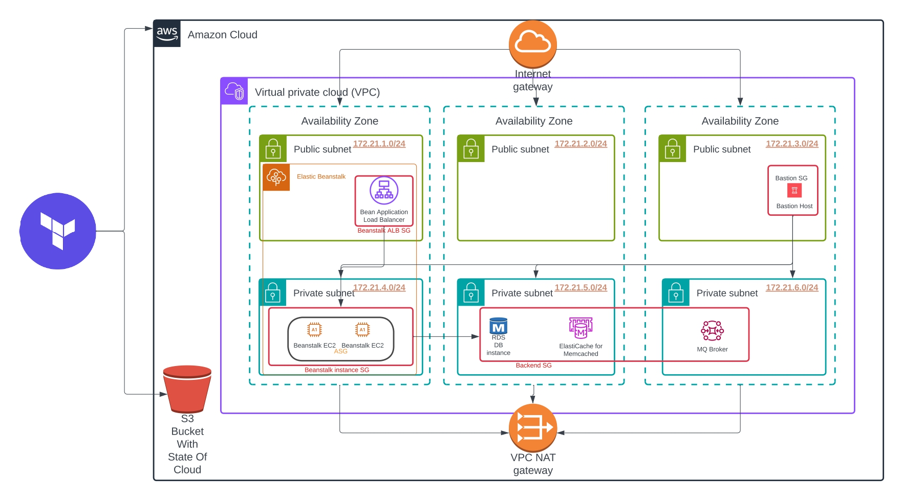

# AWS Infrastructure with Terraform | Production-Grade Architecture

This project automates the provisioning of a scalable, multi-tier infrastructure on AWS using Terraform. It simulates a production-ready environment that includes compute, networking, databases, caching, messaging, and secure access, suitable for microservices-based backend workloads.

---

## Use Case

Designed to support deployment of a Java-based web application (vProfile), this infrastructure serves as a blueprint for real-world systems requiring:

- **High availability** across multiple Availability Zones
- **Secure access** using a Bastion host and Security Groups
- **Decoupled architecture** using AWS RDS, ElastiCache, and MQ Broker
- **CI/CD integration readiness** via Elastic Beanstalk

---

## Architecture Overview



### Key Components

| Component              | Description |
|------------------------|-------------|
| VPC                    | Custom VPC with 6 subnets (3 public, 3 private) |
| NAT Gateway            | Allows outbound traffic from private subnets |
| Elastic Beanstalk      | App environment with ALB + EC2 ASG |
| Bastion Host           | SSH entry point to private subnets |
| RDS                    | PostgreSQL DB instance |
| ElastiCache            | Memcached for caching layer |
| MQ Broker              | AWS MQ (ActiveMQ) for message queuing |
| S3 Backend             | Stores remote Terraform state |

---

## Project Structure

```bash
.
├── backend.tf                # Remote state backend configuration
├── providers.tf              # AWS provider setup
├── vars.tf                   # Input variables
├── outputs.tf                # Output variables
├── vpc.tf                    # VPC, subnets, routes, NAT
├── secgrp.tf                 # Security group definitions
├── bastion-host.tf          # Bastion EC2 instance in public subnet
├── keypairs.tf              # SSH key pair generation
├── bean-env.tf              # Beanstalk environment
├── bean-app.tf              # Beanstalk application + version
├── backend-services.tf      # RDS, ElastiCache, MQ Broker
├── templates/               # Template files (user_data scripts, etc.)
├── vprofilekey / .pub       # SSH key pair for Bastion & EC2
├── terraform-vprofile.jpg   # Architecture diagram
└── README.md                # You're here!
```

---

##  Security & Networking

- Bastion access restricted via security group (`Bastion SG`) and associated with key pair `vprofilekey`
- RDS, MQ, and ElastiCache are only accessible from within private subnets
- Beanstalk ALB exposed via public subnet, EC2s run in private subnet


---

##  Deployment Workflow

```bash
# Initialize backend & provider
terraform init

# Validate syntax
terraform validate

# Preview resources
terraform plan

# Launch infrastructure
terraform apply

# Destroy infrastructure
terraform destroy
```

---

##  Outputs

After deployment, Terraform will output:

- `beanstalk_env_url`: URL to access the application
- `bastion_ip`: Public IP of bastion host
- `rds_endpoint`: DB connection string
- `mq_broker_url`: Internal endpoint for message broker

---

##  Backend State (S3)

The project uses an S3 bucket to manage remote state. This ensures:

- Team collaboration
- State locking 


Make sure the bucket exists before running `terraform init`.


---

##  Learning Goals

- Advanced VPC design
- Multi-AZ architecture with fault tolerance
- Secure SSH via bastion
- Terraform module structuring and best practices
- Real-world cloud infra automation

